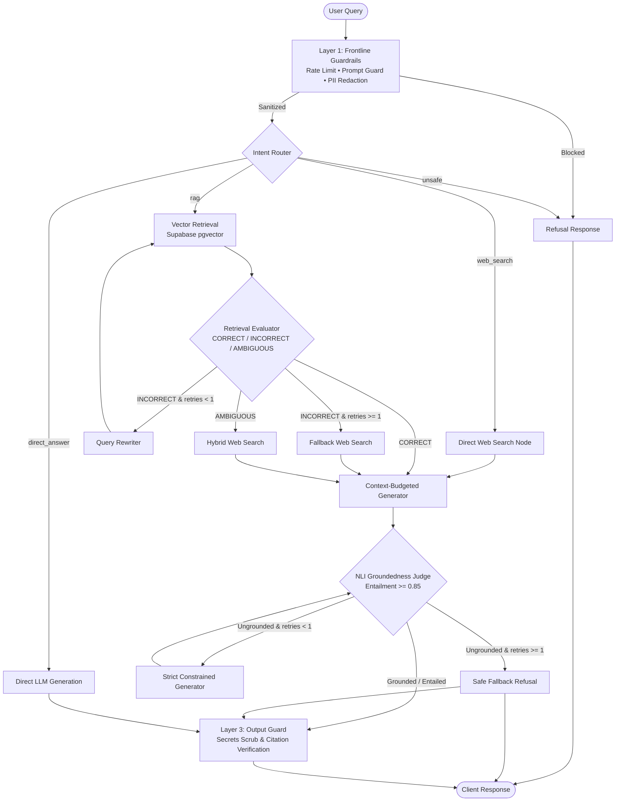

# Cortex

<p align="center">
  
  
  
  
  
  
  
  
  
  
</p>

> **Enterprise-grade Full-Stack AI Assistant featuring Corrective RAG (CRAG), Multi-Layer Guardrails, NLI Fact-Checking, and Real-Time Web Search.**

Cortex is a production-oriented, multi-agent Retrieval-Augmented Generation (RAG) system built with **FastAPI**, **LangGraph**, and **Next.js 16**. Unlike naive RAG pipelines that blindly trust retrieved snippets and LLM outputs, Cortex dynamically routes queries across specialized execution paths, evaluates document quality in real time, automatically rewrites deficient queries, falls back to live web search, and enforces an independent Natural Language Inference (NLI) judge to verify factuality before answers ever reach the user.

---

## 📑 Table of Contents

- [Key Features](#-key-features)
- [System Architecture](#-system-architecture)
- [Execution Paths & CRAG Workflow](#-execution-paths--crag-workflow)
- [Multi-Tier Defense-in-Depth Guardrails](#-multi-tier-defense-in-depth-guardrails)
- [Tech Stack](#-tech-stack)
- [Repository Layout](#-repository-layout)
- [Database & Supabase Setup (SQL)](#-database--supabase-setup-sql)
- [Getting Started](#-getting-started)
  - [Prerequisites](#prerequisites)
  - [1. Backend Setup](#1-backend-setup)
  - [2. Frontend Setup](#2-frontend-setup)
- [Running with Docker](#-running-with-docker)
- [Environment Configuration](#-environment-configuration)
- [API Reference](#-api-reference)
- [Testing & Evaluation Benchmark](#-testing--evaluation-benchmark)
- [Contributing & Development](#-contributing--development)
- [License](#-license)

---

## ✨ Key Features

- **Self-Correcting RAG (CRAG)**: Retrieval results are graded dynamically as `CORRECT`, `INCORRECT`, or `AMBIGUOUS`. Deficient queries undergo automatic semantic rewriting, with intelligent fallback to Tavily web search.
- **NLI Fact-Checking & Anti-Hallucination Judge**: Answers are scrutinized by an independent Natural Language Inference semantic judge (`ENTAILMENT`, `NEUTRAL`, `CONTRADICTION`) requiring an entailment confidence score $\ge 0.85$. Ungrounded outputs trigger strictly constrained regeneration retries or safe refusals.
- **Three Core Execution Paths + Hybrid**: Routes questions to **Document RAG**, **Real-Time Web Search**, **Direct LLM Synthesis**, or a synthesized **Hybrid** mode depending on query intent and available knowledge.
- **Defense-in-Depth Guardrails**: Frontline sliding-window rate limiting, heuristic and optional neural prompt-injection filters, bidirectional PII & sensitive secrets redaction, file magic-byte validation, indirect prompt injection quarantine, and post-generation citation scrubbing.
- **Multi-Turn Rolling Memory**: Conversational memory that retains recent turns verbatim while automatically summarizing older turns under a configurable token budget—keeping vector retrieval queries pristine.
- **Cloud-Native Vector Store**: Google Gemini `gemini-embedding-001` (768-dimensional embeddings via Matryoshka Representation Learning) stored in Supabase `pgvector` with zero local RAM/GPU bottlenecks.
- **Full File Lifecycle**: Document upload dropzone, parsed chunk inspection with cosine similarity scoring, Supabase Storage integration, and time-limited signed URLs for document preview and download.
- **Modern Next.js 16 Interface**: Responsive, dark-themed UI built with React 19, Tailwind CSS v4, Radix UI primitives, Lucide icons, live route badges, and citation drawers.
- **End-to-End Evaluation Framework**: Built-in benchmark suite to evaluate faithfulness, answer relevance, guardrail safety, and route accuracy with automated Markdown and CSV reporting.

---

## 🏛 System Architecture

```text
┌─────────────────────────────────────────────────────────────────────────┐
│                           Next.js 16 Frontend                           │
│       Chat UI  │  Document Management  │  Chunk Inspector  │  History   │
└────────────────────────────────────┬────────────────────────────────────┘
                                     │ HTTP (REST + CORS)
┌────────────────────────────────────▼────────────────────────────────────┐
│                             FastAPI Backend                             │
│   /api/chat         /api/documents/upload       /api/documents/{file}   │
└──────────┬─────────────────────────┬─────────────────────────┬──────────┘
           │                         │                         │
┌──────────▼──────────┐   ┌──────────▼──────────┐   ┌──────────▼──────────┐
│ Layer 1: Frontline  │   │ Layer 2: LangGraph  │   │ Storage & Vectors   │
│     Guardrails      │   │     CRAG State      │   │      Supabase       │
│ • Rate Limiter      │   │ • Intent Router     │   │ • pgvector chunks   │
│ • Prompt Guard      │   │ • Retriever         │   │ • Storage bucket    │
│ • PII Redactor      │   │ • Retrieval Eval    │   │ • Conversations DB  │
│ • Ingestion Guard   │   │ • Web Search Node   │   └──────────┬──────────┘
└─────────────────────┘   │ • Context Generator │              │
                          │ • NLI Judge         │              │
                          │ • Strict Retry Loop │              │
                          │ • Layer 3: Out Guard│              │
                          └──────────┬──────────┘              │
                                     │                         │
                          ┌──────────▼──────────┐              │
                          │ External Providers  │              │
                          │ • Groq LLMs         │              │
                          │ • Tavily Web Search │              │
                          │ • Gemini Embeddings ◄──────────────┘
                          └─────────────────────┘
```

---

## 🔄 Execution Paths & CRAG Workflow

Cortex routes incoming messages through four distinct paths:

| Path | Primary Source | Use Case |
|---|---|---|
| **Document RAG** | Supabase `pgvector` | Questions about uploaded PDFs, Word documents, text, and markdown files. |
| **Web Search** | Tavily Search API | Breaking news, current events, live information, and real-time internet facts. |
| **Direct LLM** | Groq (`ChatGroq`) | Math problems, code explanations, logic riddles, and general knowledge. |
| **Hybrid** | Documents + Web | Ambiguous queries or topics requiring both internal context and external data. |

### LangGraph Workflow Graph



---

## 🛡 Multi-Tier Defense-in-Depth Guardrails

Security and hallucination prevention are enforced at three distinct layers:

### Layer 1: Frontline & Ingestion Guardrails
- **Sliding-Window Rate Limiting**: Per-IP and per-session rate limits preventing denial-of-service and quota exhaustion.
- **Prompt Injection & Jailbreak Defense**: Regex heuristic engine blocking adversarial tokens, role-manipulation, and system-delimiter overrides, with support for local Hugging Face classifier models (`meta-llama/Prompt-Guard-86M`).
- **PII & Secrets Redaction**: Automatically masks emails, telephone numbers, US SSNs, IPv4 addresses, credit card numbers, and known API keys before vectors are indexed or sent to downstream LLMs. Supports Microsoft Presidio NER.
- **Document Ingestion Security**: Inspects file magic bytes (rejects spoofed extensions, executable binaries, and ELF headers) and scans document chunks for indirect prompt injections before indexing.

### Layer 2: Pipeline Reliability & Budgeting
- **Per-Node Execution Timeouts**: Explicit timeouts on router, retrieval, evaluator, web search, generation, and groundedness nodes prevent hanging processes.
- **Strict Loop Bounds**: LangGraph edges feature state counters to guarantee that query rewriting and constrained generation never enter infinite cycles.
- **Context Token Ceilings**: Strict character-level budgets truncate document context (~2,500 tokens) and web snippets (~1,250 tokens) to minimize latency, avoid context dilution, and keep inference costs predictable.

### Layer 3: Output Guard & Verification
- **Output Scrubbing**: Sanitizes leaked system delimiters, prompt templates, and sensitive credentials from final responses.
- **Citation Verification**: Cross-references citations in generated answers against actual retrieved document filenames and live Tavily URLs to eliminate hallucinated sources.

---

## 💻 Tech Stack

### Backend
- **Language**: Python 3.12+
- **Framework**: [FastAPI](https://fastapi.tiangolo.com/) with Uvicorn ASGI
- **Workflow Orchestration**: [LangGraph](https://www.langchain.com/langgraph) & [LangChain](https://www.langchain.com/)
- **Inference Engine**: [Groq](https://groq.com/) (`openai/gpt-oss-120b` for reasoning/synthesis, `openai/gpt-oss-20b` for routing/evaluation)
- **Embeddings**: Google Gemini `gemini-embedding-001` (768 dimensions via MRL)
- **Vector Store**: [Supabase](https://supabase.com/) with `pgvector`
- **Web Search**: [Tavily API](https://tavily.com/)
- **Document Extractors**: PyMuPDF (`fitz`), python-docx, docx2txt
- **Package Manager**: [uv](https://docs.astral.sh/uv/) (lockfile: `backend/uv.lock`)

### Frontend
- **Framework**: [Next.js 16](https://nextjs.org/) (App Router)
- **Library**: [React 19](https://react.dev/)
- **Styling**: [Tailwind CSS v4](https://tailwindcss.com/) (`@tailwindcss/postcss`)
- **UI Components**: Radix UI Primitives (`@radix-ui/react-*`), Sonner
- **Icons**: [Lucide React](https://lucide.dev/)
- **Package Manager**: [pnpm](https://pnpm.io/)

---

## 📂 Repository Layout

```text
Cortex/
├── backend/                         # FastAPI + LangGraph service
│   ├── api/                         # REST API endpoints
│   │   ├── chat.py                  # POST /api/chat, DELETE /api/sessions/{id}
│   │   └── documents.py             # Upload, list, url, and delete endpoints
│   ├── crag/                        # LangGraph workflow definition
│   │   ├── graph.py                 # Graph compilation and execution runners
│   │   ├── nodes.py                 # Router, retrieve, eval, search, generate, judge
│   │   ├── edges.py                 # Conditional routing and loop bounds
│   │   └── state.py                 # CRAGState TypedDict
│   ├── guardrails/                  # 3-tier security implementations
│   │   ├── rate_limiter.py          # Sliding window rate limiter
│   │   ├── prompt_guard.py          # Heuristic & neural injection defense
│   │   ├── pii_redactor.py          # Regex & Presidio PII masker
│   │   ├── ingestion_guard.py       # Magic bytes & indirect injection scanner
│   │   └── output_guard.py          # Delimiter scrubber & citation validator
│   ├── rag/                         # Document parsing & storage
│   │   ├── document_processor.py    # Multi-format parser, sanitization, chunking
│   │   ├── embeddings.py            # Gemini 768-dim embedding clients
│   │   ├── vector_store.py          # Supabase pgvector operations & RPC
│   │   └── storage_service.py       # Supabase Storage bucket management
│   ├── services/                    # Domain logic & LLM services
│   │   ├── router_service.py        # Structured intent classifier
│   │   ├── evaluator_service.py     # Retrieval quality evaluation & rewrite
│   │   ├── search_service.py        # Tavily search query generator & client
│   │   ├── generator_service.py     # Budgeted generation (RAG, Web, Hybrid)
│   │   ├── groundedness_service.py  # NLI semantic fact-check judge
│   │   └── conversation_service.py  # Session history & LLM summarization
│   ├── evals/                       # Automated benchmarking suite
│   ├── tests/                       # Pytest unit and integration tests
│   ├── config.py                    # Central environment configuration
│   ├── main.py                      # FastAPI application entrypoint
│   ├── Dockerfile                   # Production backend container image
│   └── pyproject.toml               # Python dependencies and metadata
├── frontend/                        # Next.js 16 Chat UI
│   ├── app/                         # App Router pages and layouts
│   │   ├── components/              # ChatInput, ChatMessage, Sidebar, Upload
│   │   ├── globals.css              # Tailwind v4 theme and design tokens
│   │   ├── layout.tsx               # Root application layout
│   │   └── page.tsx                 # Main interactive chat interface
│   ├── Dockerfile                   # Multi-stage production frontend image
│   └── package.json                 # Node dependencies and scripts
├── docker-compose.yml               # Container orchestration for full stack
├── AGENTS.md                        # Coding guidelines for AI assistants
└── README.md                        # Documentation (this file)
```

---

## 🗄 Database & Supabase Setup (SQL)

Cortex uses Supabase for **vector similarity search**, **conversation history persistence**, and **raw document storage**.

Log in to your Supabase project, navigate to the **SQL Editor**, and run the following script:

```sql
-- 1. Enable pgvector extension
CREATE EXTENSION IF NOT EXISTS vector;

-- 2. Create document_chunks table for RAG embeddings
CREATE TABLE IF NOT EXISTS document_chunks (
    id BIGSERIAL PRIMARY KEY,
    session_id TEXT NOT NULL,
    content TEXT NOT NULL,
    source TEXT NOT NULL,
    embedding VECTOR(768) NOT NULL,
    created_at TIMESTAMPTZ DEFAULT NOW()
);

-- Index for session isolation and vector cosine similarity search
CREATE INDEX IF NOT EXISTS idx_chunks_session ON document_chunks(session_id);
CREATE INDEX IF NOT EXISTS idx_chunks_embedding ON document_chunks 
USING ivfflat (embedding vector_cosine_ops) WITH (lists = 100);

-- 3. Create similarity matching RPC function
CREATE OR REPLACE FUNCTION match_document_chunks (
    query_embedding VECTOR(768),
    match_threshold FLOAT,
    match_count INT,
    filter_session_id TEXT
)
RETURNS TABLE (
    id BIGINT,
    content TEXT,
    source TEXT,
    similarity FLOAT
)
LANGUAGE plpgsql
AS $$
BEGIN
    RETURN QUERY
    SELECT
        document_chunks.id,
        document_chunks.content,
        document_chunks.source,
        1 - (document_chunks.embedding <=> query_embedding) AS similarity
    FROM document_chunks
    WHERE document_chunks.session_id = filter_session_id
      AND 1 - (document_chunks.embedding <=> query_embedding) > match_threshold
    ORDER BY document_chunks.embedding <=> query_embedding
    LIMIT match_count;
END;
$$;

-- 4. Create conversations table for multi-turn chat history
CREATE TABLE IF NOT EXISTS conversations (
    id BIGSERIAL PRIMARY KEY,
    session_id TEXT NOT NULL,
    role TEXT NOT NULL CHECK (role IN ('user', 'assistant', 'system')),
    content TEXT NOT NULL,
    created_at TIMESTAMPTZ DEFAULT NOW()
);

CREATE INDEX IF NOT EXISTS idx_conversations_session ON conversations(session_id);

-- 5. Create storage bucket for uploaded documents
INSERT INTO storage.buckets (id, name, public)
VALUES ('documents', 'documents', false)
ON CONFLICT (id) DO NOTHING;
```

---

## 🚀 Getting Started

### Prerequisites

- **Python**: 3.12 or newer
- **uv**: Fast Python package manager ([install instructions](https://docs.astral.sh/uv/getting-started/installation/))
- **Node.js**: 20+ and **pnpm** ([install instructions](https://pnpm.io/installation))
- API Keys for:
  - [Groq](https://console.groq.com/)
  - [Tavily](https://tavily.com/)
  - [Google AI Studio](https://aistudio.google.com/) (Gemini API)
  - [Supabase](https://supabase.com/)

---

### 1. Backend Setup

```bash
# Clone the repository
git clone https://github.com/sohail22dec/cortex.git
cd cortex/backend

# Sync Python dependencies using uv
uv sync

# Create your environment file
cp .env.example .env
```

Edit `backend/.env` with your credentials:

```ini
GROQ_API_KEY=gsk_...
TAVILY_API_KEY=tvly-...
SUPABASE_URL=https://your-project.supabase.co
SUPABASE_KEY=eyJhbGciOi...
GEMINI_API_KEY=AIzaSy...

# Optional Model Customization (Defaults)
GROQ_REASONING_MODEL=openai/gpt-oss-120b
GROQ_FAST_MODEL=openai/gpt-oss-20b
```

Start the backend development server:

```bash
uv run python main.py
```

The API will start at **`http://localhost:8000`**. You can verify it by opening `http://localhost:8000/api/health` or viewing interactive docs at `http://localhost:8000/docs`.

---

### 2. Frontend Setup

In a new terminal window:

```bash
cd cortex/frontend

# Install dependencies
pnpm install

# Configure backend API address
echo "NEXT_PUBLIC_API_URL=http://localhost:8000" > .env.local

# Launch the Next.js development server
pnpm dev
```

Open **`http://localhost:3000`** in your browser.

---

## 🐳 Running with Docker

You can run both backend and frontend using Docker Compose:

1. Configure `backend/.env` with your API keys.
2. Build and launch containers:

```bash
docker compose up --build -d
```

3. Access services:
   - **Frontend UI**: [http://localhost:3001](http://localhost:3001) *(mapped to container port 3000)*
   - **Backend API**: [http://localhost:8001](http://localhost:8001) *(mapped to container port 8000)*
   - **Interactive OpenAPI Docs**: [http://localhost:8001/docs](http://localhost:8001/docs)

To shut down:

```bash
docker compose down
```

---

## ⚙️ Environment Configuration

All backend parameters are loaded through `backend/config.py` with safe production defaults:

| Variable | Type | Default | Description |
|---|---|---|---|
| `GROQ_API_KEY` | `str` | *Required* | Groq API key for LLM inference. |
| `TAVILY_API_KEY` | `str` | *Required* | Tavily API key for real-time web search. |
| `SUPABASE_URL` | `str` | *Required* | Supabase project URL. |
| `SUPABASE_KEY` | `str` | *Required* | Supabase service-role or secret key. |
| `GEMINI_API_KEY` | `str` | *Required* | Google Gemini API key for cloud embeddings. |
| `GROQ_REASONING_MODEL` | `str` | `openai/gpt-oss-120b` | High-parameter model for synthesis and strict retry. |
| `GROQ_FAST_MODEL` | `str` | `openai/gpt-oss-20b` | Fast model for routing, eval, and summarization. |
| `ENABLE_RATE_LIMITING` | `bool` | `true` | Enables sliding-window rate limiter. |
| `RATE_LIMIT_CHAT_REQUESTS`| `int` | `100` | Max chat requests per window per IP/session. |
| `ENABLE_PROMPT_GUARD` | `bool` | `true` | Enables prompt injection & jailbreak detection. |
| `ENABLE_PII_REDACTION` | `bool` | `true` | Redacts emails, phones, SSNs, and API keys. |
| `ENABLE_INGESTION_GUARD` | `bool` | `true` | Validates file magic bytes and scans chunks. |
| `TIMEOUT_ROUTER` | `float` | `15.0` | Execution timeout in seconds for router node. |
| `TIMEOUT_RETRIEVAL` | `float` | `4.0` | Execution timeout for vector search node. |
| `TIMEOUT_GENERATION` | `float` | `12.0` | Execution timeout for generation node. |
| `TIMEOUT_GROUNDEDNESS` | `float` | `5.0` | Execution timeout for NLI judge node. |
| `MAX_DOC_CONTEXT_CHARS` | `int` | `10000` | Truncation budget for document context (~2,500 tokens). |
| `MAX_WEB_CONTEXT_CHARS` | `int` | `5000` | Truncation budget for web search snippets. |
| `MAX_CONVERSATION_TOKENS` | `int` | `4000` | Token budget for past conversation history. |
| `MAX_RECENT_MESSAGES` | `int` | `2` | Number of most recent turns to keep verbatim. |

---

## 🔌 API Reference

### System & Health

| Method | Endpoint | Description |
|---|---|---|
| `GET` | `/` | API status, name, and version information. |
| `GET` | `/api/health` | Container and uptime health check (`{"status": "healthy"}`). |

### Chat & Sessions

| Method | Endpoint | Description |
|---|---|---|
| `POST` | `/api/chat` | Main conversational endpoint. Executes frontline guardrails, conversation history retrieval, CRAG graph execution, and output scrubbing. |
| `DELETE` | `/api/sessions/{session_id}` | Purges all conversation history, vector chunks, and stored files associated with the session. |

#### Request Body (`POST /api/chat`):
```json
{
  "message": "What are the quarterly revenues mentioned in the report?",
  "session_id": "session_abc123",
  "user_id": "optional_user_id"
}
```

#### Response Body:
```json
{
  "answer": "According to page 4 of the financial report, quarterly revenues grew by 14%...",
  "source": "rag",
  "citations": ["Q3_Financials.pdf"],
  "route": "rag",
  "suggest_web_search": false,
  "chunks": [
    {
      "source": "Q3_Financials.pdf",
      "text": "Quarterly revenue reached $4.2M representing a 14% year-over-year increase...",
      "similarity": 0.82
    }
  ],
  "web_results": [],
  "evaluation_result": "CORRECT",
  "evaluation_reason": "Retrieved chunks contain direct financial metrics.",
  "is_grounded": true,
  "groundedness_reason": "Claims are fully entailed by document excerpts.",
  "transformed_query": null,
  "nli_verdict": "ENTAILMENT",
  "nli_score": 0.96
}
```

### Documents & Knowledge Base

| Method | Endpoint | Description |
|---|---|---|
| `POST` | `/api/documents/upload` | Multipart file upload (`.pdf`, `.docx`, `.doc`, `.txt`, `.md`). Validates magic bytes, chunks, generates 768-dim embeddings, and indexes into Supabase. |
| `GET` | `/api/documents?session_id={id}` | Lists all documents uploaded for the active session along with chunk counts. |
| `GET` | `/api/documents/{filename}/url?session_id={id}` | Returns a signed temporary Supabase Storage URL to view or download the uploaded document. |
| `DELETE` | `/api/documents/{filename}?session_id={id}` | Removes the document file from Supabase Storage and deletes all its chunks from `pgvector`. |

---

## 🧪 Testing & Evaluation Benchmark

### Running Unit & Integration Tests

Backend tests cover guardrails, API routes, context budgets, reliability, and graph edge logic:

```bash
cd backend
uv run pytest tests/ -v
```

### Automated RAG Evaluation Benchmark

Cortex includes an evaluation framework that measures:
1. **Faithfulness / Groundedness**: Whether claims are entailed by context.
2. **Answer Relevance**: Whether the generated response directly addresses the query.
3. **Guardrail Safety**: Successful rejection of prompt injections and redaction of PII.
4. **Route Accuracy**: Correct categorization among RAG, web search, direct answer, and unsafe.

Run the evaluation runner:

```bash
cd backend
uv run python -m evals.runner
```

Run with custom parameters:

```bash
# Filter by category or limit samples
uv run python -m evals.runner --category fact_retrieval --samples 10
```

Benchmark outputs are saved to `backend/evals/reports/` in Markdown and CSV formats.

---

## 🛠 Contributing & Development

We welcome contributions! Please adhere to the following standards:

1. **Python**:
   - Always include `from __future__ import annotations` at the top of new files.
   - Use async/await for I/O bounds and offload blocking tasks via `asyncio.to_thread`.
   - Ensure all tests pass with `uv run pytest tests/`.
2. **Frontend**:
   - Maintain strict typing with TypeScript.
   - Ensure `pnpm lint` and `pnpm build` complete with zero errors or warnings.
3. **Guidelines for AI Coding Agents**:
   - Read [`AGENTS.md`](./AGENTS.md) for detailed architectural constraints and development conventions.

---

## 📄 License

This project is licensed under the [MIT License](./LICENSE) © 2025–2026 [Sohail Islam](https://github.com/sohail22dec).
